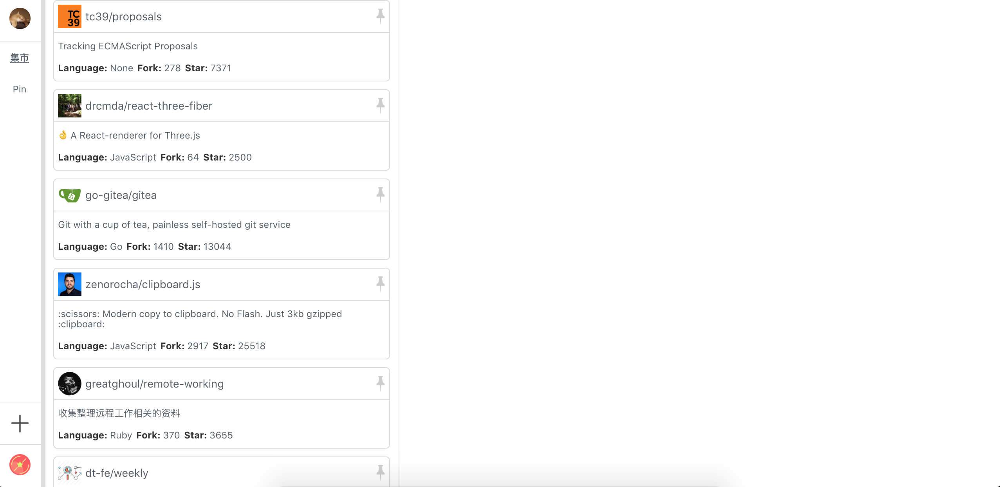

# blockflats

自己的事情自己做主，github 管理。




## Install

```bash
$ cd manage
$ yarn
```

```bash
$ cd manage_service
$ yarn
```

## Service 配置

在 manage_service/app 目录下创建 `app_config.ts` 文件：

```js
export const GITHUB_CLIENT_ID = '';
export const GITHUB_CLIENT_SECRET = '';
export const LEANCLOUD_DB_APP_ID = '';
export const LEANCLOUD_DB_APP_KEY = '';
```

- Github 创建一个 Application 将 clientId 和 client Secret 添加到 GITHUB_CLIENT_ID 和 GITHUB_CLIENT_SECRET 常量中
- 使用 LeanCloud 创建一个应用 将 AppId 和 AppKey 添加到 LEANCLOUD_DB_APP_ID 和 LEANCLOUD_DB_APP_KEY 常量中
- Github Application Authorization callback URL 请填写 `http://localhost:8999/path`（本地开发阶段）

## Develop

启动 Service

```bash
$ cd manage_service
$ npm run dev
```

启动前端项目

```bash
$ cd manage
$ npm start
```

- 在浏览器中先使用 `http://localhost:8999/` 进行授权验证
- 然后使用 `http://localhost:3000/` 进行开发